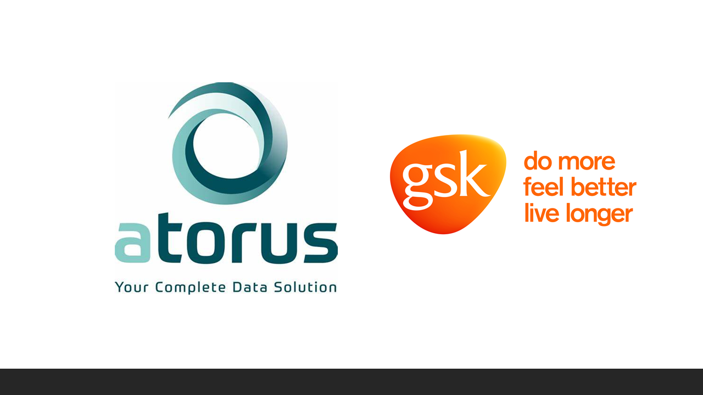

class: middle, center

# Objective

## Demonstrate how to make a RStudio Addin and utilize the timber package to create logs for your R scripts.


```{r, echo=FALSE, out.width="25%"}

```

---

class: middle, center

# Outline

<br/>

Showcase a RStudio Addin 

Why worry about a log?

Features of timber

Running code with timber package and Addin

---

class: middle, center

# Showcase a RStudio Addin

{styler} is an R package that formats your code according to the [tidyverse style
guide](https://style.tidyverse.org) in a non-invasive and safe way


```{r, out.width = "650px", echo = FALSE}
knitr::include_graphics("https://raw.githubusercontent.com/lorenzwalthert/some_raw_data/master/styler_0.1.gif")
```

---


# RStudio Addin Walkthrough

<iframe src='www/rstudioaddin.html' style="width:100%;height:85%;"/>


---

# Challenges of using an Open-Source Language in a Regulated Environment

.two-column[

  .left-col[

  **An Incomplete List of Challenges** 

  - SAS® processes have years of use within regulatory agencies and tend to take precedence.   

  - Company Firewalls and VPNs.  

  - Sharing of code and data. 

  - Does a R package bend to SAS® processes or does the package recreate/redefine the process?

  - Who maintains the open-source product?

  ]

  .right-col[

  **An Incomplete List of Solutions**

  - Github, Gitlab and etc. help us to share, fix and build up code in an interactive and version-controlled process.

  - R Consortium is working with the FDA to investigate delivering a submission in R.

  - R packages already out there that mimic some of SAS® processes – {haven}, {SASxport}

  - Pharma companies will have a vested interest in maintaining these packages.
  
  - New graduates are coming out of school with R and Python skills

  ]

]

---

# Risk Mitigation: Why xportr pacakge is not on CRAN(yet)
.two-column[

.left-col[

### Backend dependancy issues

### Limited time from OS developers

### Difficulty Explaining the Need for Changes

]

.right-col[
- [Dec 11, 2020 - SASxport Issue Reported](https://github.com/r-gregmisc/SASxport/issues/20) 

- [Feb 5, 2021 - PR to SASxport merged in](https://github.com/r-gregmisc/SASxport/pull/21) 

- [Nov 17, 2021 - Issue with haven reported](https://github.com/tidyverse/haven/issues/650) 

- [Nov 23, 2021 - Fix in underlying haven library patched](https://github.com/WizardMac/ReadStat/pull/258) 

- [Feb 21, 2022 - New release for haven backend](https://github.com/WizardMac/ReadStat/releases/tag/v1.1.8-rc0)

- [Feb 25, 2022 - Backend updates made to haven](https://github.com/tidyverse/haven/pull/659) 

- In Progress - Updates to xportr to switch to haven.

]

]

---

# {metacore}

.two-column[

.left-col[

]

.right-col[
**Challenges for R in CRP**

- No available R packages that can ingest and parse metadata for clinical trial datasets or help build a define.xml.

**Solutions**

- Built functions for parsing xml data and other data types specific to clinical trial datasets.

- Functions and objects can be leveraged to help for dataset and variable creation as well as user for creating and codelist and derivations.

**Future development path**

- Working with different company's metadata files as well as in-development packages, e.g., admiral, to leverage metadata upstream or downstream.
]

]

---

# {timber}

.two-column[

.left-col[

]


.right-col[
**Challenges for R in CRP**

- There is no SAS-like log file for R-based programs that show traceability and help to create audit-ready code.

**Solutions**

- Created a utilities and wrapper functions to capture user info, session information and warnings and errors in an easy-to-read format.

- Allows for recreation of script, not just the output.

**Future development path**

- Interactive display screen to batch submit multiple programs.

- What else should go in a log?  Companies might have different needs.
]
]


---

# {xportr}

.two-column[

.left-col[

]

.right-col[
**Challenges for R in CRP**

- Writing a compliant xpt file using haven or other xpt-supported packages is challenging for types, lengths and labels

**Solutions**

- Adding well defined metadata

- Helps to write compliant xpt files

- Logs and messages for information about metadata

- Checks on the data before final output

**Future development path**

- How to ingest metadata specifications from different companies and different file formats
]
]

---

# Features of timber

.center[
```{r, echo = FALSE, results = 'asis'}
nomnoml::nomnoml(
  "[<frame>timber workflow|
  [axecute.R|
  CRFs
  Lab Assays
  PK
  Medical Coding
]

[Tabulation|
  SDTM
  Traceability
  No derivations
  Comprehensive
]

[Analysis Ready|
ADaM
\"One Proc Away\"
\"One %>% Away\"
Derived data
Traceability
] 

[Results|
Data Displays
Case Study Report
Submission Package
Quality Control
]

[Delivery to Agency|
eCTD Portal
]

[Collected] -> [Tabulation]
[Tabulation] -> [Analysis Ready]
[Results] -> [Delivery to Agency]
]",
width = 1000,
height = 500
)
```
]

---

# timber Addin and axecute Walkthrough

<iframe src='www/rstudioaddin.html' style="width:100%;height:85%;"/>


---


# Welcome to the `{pharmaverse}`!


