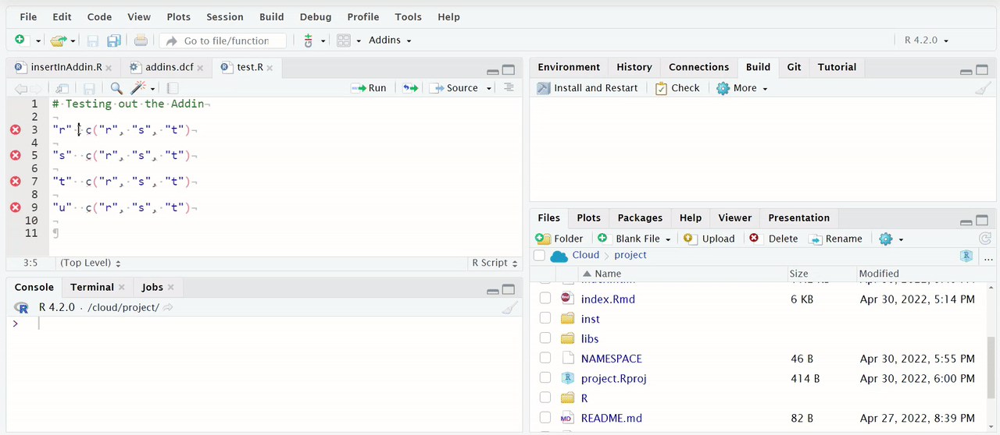

class: middle, center

# By the end of this presentation you will:

<br/>

Understand how to make a simple RStudio Addin.

Understand how to axecute your R script using timber.

<br/>
<br/>

```{r, echo=FALSE, out.width="25%"}
knitr::include_graphics("www/img/ctg.png")
```

---

class: middle, center

# Outline

<br/>

The styler Addin

Showcase how to build a simple RStudio Addin 

Why worry about a log?

Workflow and notable features of the timber log

axecute a R Script with the timber package and Addin

NB: Assumptions

---

class: middle, center

# 

<iframe src='www/rubbish.html' style="width:100%;height:85%;"/>

---

class: middle, center

# styler Addin

{styler} is an R package that formats your code according to the [tidyverse style
guide](https://style.tidyverse.org) in a non-invasive and safe way


```{r, out.width = "650px", echo = FALSE}
knitr::include_graphics("https://raw.githubusercontent.com/lorenzwalthert/some_raw_data/master/styler_0.1.gif")
```

---

class: middle, center


<iframe src='www/rubbish_style.html' style="width:100%;height:85%;"/>

---


<iframe src='www/rstudioaddin.html' style="width:100%;height:85%;"/>

---

# Hello Addin


A few simple files to create additional functionality within the RStudio Environment.

```{r, out.width = "1000px", echo = FALSE}

```

* You can map this Addin to a shorcut/hot key.

---

# Why care about logs when programming with R?

.center[
```{r, echo = FALSE, results = 'asis'}
nomnoml::nomnoml(
  "[<frame>Logging your concerns|

[Audit-Ready]

[Ready!|
Quickly re-build an old environment
Demonstrate programs have run successfully
Demonstrate all programs are clean and free of errors
Custom global checks on programs
]
  
[Logging in R]

[Logs|
  R does not naturally create a log file
  There are many possible ways to create a log file
  Clinical Environment creates a unique siutation
]

[SAS Logs]

[R Logs|
Does a R Log need to be like a SAS Log?
Could a user decide on unique customization
A new way of thinking!!?
]

[Logging in R] -> [Logs]
[Audit-Ready] -> [Ready!]
[SAS Logs] -> [R Logs]
]",
width = 1000,
height = 500
)
```
]


---

# [timber](https://github.com/atorus-research/timber)

.two-column[

.left-col[


]


.right-col[

**Objective**

Tools to facilitate logging in a clinical environment to make code easily traceable and reproducible.

**Notable Highlights**

Built around the concept of creating a log for the execution of an R script that provides an overview of what happened as well as the environment that it happened in.

Built with Clinical Reporting Environment in mind.

All code available on [GitHub](https://github.com/atorus-research/timber) and [upcoming vignettes and walk-throughs](https://atorus-research.github.io/timber/) on accompanying site.  

]
]

---


# Features of timber

.center[
```{r, echo = FALSE, results = 'asis'}
nomnoml::nomnoml(
  "[<frame>timber workflow|
  [R Script is Ready to go|
  timber is installed
  Addin should be available after install
]

[Using Addin|
  axecute your R Script
  Toggle options available for more nuance 
  Recent update - now possible to include  
  approved/unapproved functions.
]

[Run Script from another Script or Console|
  Use a script to axecute one file
  Run from console
  Set up script for batch axecution
  Any options available in Addin are also in axecute    
  function call
] 

[Inspect log File|
  Metadata
  User and File Information
  Session Information (OS, Version, etc)
  Package Info (Version, Dates, From)
  External Software
  Masked, Approved, Unapproved
  Warnings, Errors and Messages
  Output
  Run time and Location
]


[R Script is Ready to go] -> [Using Addin]
[R Script is Ready to go] -> [Run Script from another Script or Console]
[Using Addin] -> [Inspect log File]
[Run Script from another Script or Console] -> [Inspect log File]
]",
width = 1000,
height = 500
)
```
]

---

# admiral adsl.R template script with a few additions

<iframe src='www/adslR.html' style="width:100%;height:85%;"/>

---

# Let's axecute

```{r, out.width = "1000px", echo = FALSE}
knitr::include_graphics("m8mnmc.gif")
```

---

# axecuting adsl.R gives us an adsl.log

<iframe src='www/adsllog.html' style="width:120%;height:85%;"/>

---

# Approved packages and functions

<iframe src='www/approved.html' style="width:120%;height:85%;"/>

---

# Welcome to the `{pharmaverse}`!


