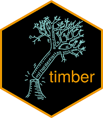

class: middle, center

# By the end of this presentation you will:

<br/>

Understand how to make a simple RStudio Addin.

Understand how to axecute your R script using timber.

<br/>
<br/>

```{r, echo=FALSE, out.width="25%"}
knitr::include_graphics("www/img/ctg.png")
```

---

class: middle, center

# Outline

<br/>

The styler Addin

Showcase how to build a simple RStudio Addin 

Why worry about a log and what's up with the axes?

Notable features of the timber package

Running a R Script with the timber package and Addin

NB: Assumptions

---

class: middle, center

# 

<iframe src='www/rubbish.html' style="width:100%;height:85%;"/>

---

class: middle, center

# styler Addin

{styler} is an R package that formats your code according to the [tidyverse style
guide](https://style.tidyverse.org) in a non-invasive and safe way


```{r, out.width = "650px", echo = FALSE}
knitr::include_graphics("https://raw.githubusercontent.com/lorenzwalthert/some_raw_data/master/styler_0.1.gif")
```

---

class: middle, center


<iframe src='www/rubbish_style.html' style="width:100%;height:85%;"/>

---


<iframe src='www/rstudioaddin.html' style="width:100%;height:85%;"/>

---

# Hello Addin

A few simple files to create additional functionality within the RStudio Environment.

```{r, out.width = "650px", echo = FALSE}

```

---

# Why care about logs when programming with R?

.center[
```{r, echo = FALSE, results = 'asis'}
nomnoml::nomnoml(
  "[<frame>Logging your concerns|
[Logging in R]

[Logs|
  R does not naturally create a log file
  Many possible ways to create a log file
  Clinical Environment creates a unique siutation
]

[Audit-Ready]

[Ready!|
Quickly re-build an old environment
Demonstrate all programs are clean and free of errors
Custom global checks on programs
]

[SAS Logs]

[R Logs|
Does a R Log need to be like a SAS Log?
Room for improvement
More unique customization
A new way of thinking!!?
]

[Logging in R] -> [Logs]
[Audit-Ready] -> [Ready!]
[SAS Logs] -> [R Logs]
]",
width = 1000,
height = 500
)
```
]


---

# [timber](https://github.com/atorus-research/timber)

.two-column[

.left-col[


]


.right-col[

**Objective**

Tools to facilitate logging in a clinical environment. 

**Notable Highlights**

Goal of making code easily traceable and reproducible.

Built around the concept of creating a log for the execution of an R script that provides an overview of what happened as well as the environment that it happened in.

Built with Clinical Reporting Environment in mind.

]
]

---


# Features of timber

.center[
```{r, echo = FALSE, results = 'asis'}
nomnoml::nomnoml(
  "[<frame>timber workflow|
  [axecute.R|
  CRFs
  Lab Assays
  PK
  Medical Coding
]

[Tabulation|
  SDTM
  Traceability
  No derivations
  Comprehensive
]

[Analysis Ready|
ADaM
\"One Proc Away\"
\"One %>% Away\"
Derived data
Traceability
] 

[Results|
Data Displays
Case Study Report
Submission Package
Quality Control
]

[Delivery to Agency|
eCTD Portal
]

[Collected] -> [Tabulation]
[Tabulation] -> [Analysis Ready]
[Results] -> [Delivery to Agency]
]",
width = 1000,
height = 500
)
```
]

---

# timber adsl.R example

<iframe src='www/adslR.html' style="width:100%;height:85%;"/>

---

# timber adsl.log example

<iframe src='www/adsllog.html' style="width:120%;height:85%;"/>


---


# Welcome to the `{pharmaverse}`!


